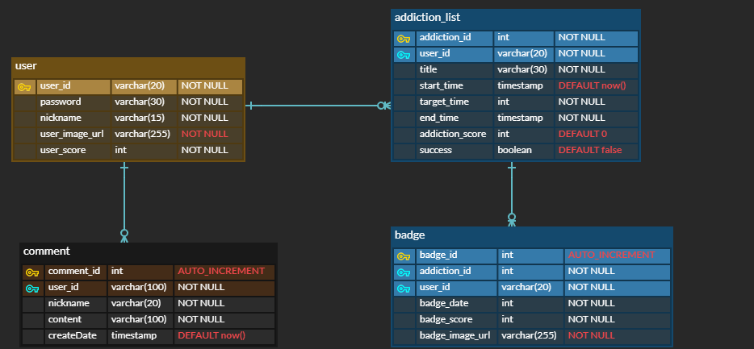

<!-- 프로젝트 소개, ERD, 간단 명세, 역할 -->

# healing-forest (힐링포레스트)

## ✔ Introduce

- **주제 : 사용자가 중독을 끊는 것을 목표로 한 서비스**
  - 사용자가 끊고 싶은 중독을 설정하고 목표 일수를 설정하여 해당 기간동안 중독 물질을 끊었는지 확인할 수 있다
  - 연속으로 오랜 기간동안 끊는 것에 성공하는 것을 챌린지 형식으로 하여 뱃지, 랭킹을 부여한다.
  - 랭킹 시스템으로 금욕왕 랭킹과 자신의 랭킹을 볼 수 있다.
- **개발 인원**
  - 팀장: 박희연 [@hi-react](https://github.com/hi-react)
  - 팀원: 박건택 [@qkrrjsxor](https://github.com/qkrrjsxor)
- **개발 기간**
  - 2024.05.16 ~ 2024.05.24
- **주요 기능**
  - 메인 랜딩 페이지
  - 로그인 및 회원가입
  - 중독 끊기 리스트 CRUD
  - 랭킹 게시판
  - 마이페이지
  - (선택 : 동기부여 멘트)

## ✔ Tech Stack

- **프론트엔드**
  - Windows, MacOS
  - Vue.js
  - Javascript
- **백엔드**
  - Windows, MacOS
  - Java
  - SpringBoot
- **데이터베이스**
  - MySQL
- **형상 관리 및 이슈 관리**
  - Github

## ✔ Conventions

<details>
<summary><b> Github Commit Convention</b></summary>

1. 커밋 유형 지정

   - 커밋 유형은 영어 대문자로 작성하기

   | 커밋 유형 | 의미                                                |
   | --------- | --------------------------------------------------- |
   | Feat:     | 새로운 기능 추가                                    |
   | Modify:   | 코드 수정 (ex. 변수, 메서드 등 수정)                |
   | Docs:     | 문서 변경 (Readme 작성, assets 추가 등)             |
   | Chore:    | 패키지 매니저 수정, 그 외 설정 수정 (.gitignore 등) |
   |           | package.json → router / pinia / axios               |
   | Refactor: | 코드 리팩토링                                       |
   | Design:   | CSS 등 사용자 UI 디자인 변경                        |
   | Fix:      | 버그 수정                                           |
   | Hotfix:   | 급하게 수정하거나 모든 사람이 pull 받아야 하는 경우 |
   | Resolve:  | merge 시 병합 충돌 해결                             |

2. [제목]과 [본문] → 빈행으로 분리

   - 커밋 유형 이후 **제목**과 **본문**은 한글로 작성
   - 내용이 잘 전달될 수 있도록 할 것
   - **본문**에는 변경한 내용과 이유 설명 (어떻게보다는 무엇 & 왜를 설명)

3. [제목] 첫 글자는 대문자로, 끝에는 `.` 금지

4. [제목] 영문 기준 50자 이내로 할 것

5. [본문] 여러가지 항목이 있다면 글머리 기호를 통해 가독성 높이기

</details>

<details>
<summary><b>Github Branch Convention</b></summary>

**Branch 네이밍**

- `master`
- `dev`
- `front/comments`
- `back/comments`

**Branch Commit 순서**

1. 본인 기능 구현한 브랜치 push 하기 (내 작업물 back-up)
   `back/comments` → `git add .` → `git commit` → `git push origin back/comments`
2. 본인 기능 구현한 브랜치에 dev 브랜치 pull 받기 → `git pull origin dev`
   → 충돌 발생 시, 충돌 해결
3. 본인 브랜치에 push 함 → `git push origin back/comments`
4. 본인 브랜치 `back/comments`에서 → `dev`로 PR 날림
</details>

## ✔ Details

### API 명세서

| 분류           | 항목           | router                | API URL                      | method |
| -------------- | -------------- | --------------------- | ---------------------------- | ------ |
| home           | 최초 화면      | /                     | /                            | GET    |
| user           | 회원가입       | /signup               | /api-user/signup             | POST   |
|                | 로그인         | /login                | /api-user/login              | GET    |
|                | 로그아웃       |                       |                              | GET    |
| addiction_list | 등록           | /addiction/create     | /api-addiction/addiction     | POST   |
|                | 전체 조회      | /addiction            | /api-addiction/addiction     | GET    |
|                | 상세 조회      | /addiction/:id        | /api-addiction/addiction/:id | GET    |
|                | 수정           | /addiction/update/:id | /api-addiction/addiction/:id | PUT    |
|                | 삭제           |                       | /api-addiction/addiction/:id | DELETE |
| badge          | 조회           | /addiction/:id        | /api-badge/badge/:id         | GET    |
|                | 등록           | /addiction/:id        | /api-badge/badge/:id         | POST   |
| community      | rank 조회      | /community            | /api-community/rank          | GET    |
|                | 내 점수 조회   | /community            | /api-community/myscore       | GET    |
|                | 댓글 전체 조회 | /community            | /api-community/comment       | GET    |
|                | 댓글 등록      | /community            | /api-comunity/comment        | POST   |
|                | 댓글 수정      | /community            | /api-community/comment/:id   | PUT    |
|                | 댓글 삭제      | /community            | /api-community/comment/:id   | DELETE |

### Database 설계

- **ER Diagram**
  <!--  -->
  

    <details>
    <summary><b>DB Schema</b></summary>

  ```sql
  DROP DATABASE IF EXISTS ssafy_healing_forest;

  CREATE DATABASE ssafy_healing_forest;

  USE ssafy_healing_forest;

  CREATE TABLE `user`(
  `user_id` varchar(20) NOT NULL PRIMARY KEY,
  `password` varchar(30) NOT NULL,
  `nickname` varchar(15) NOT NULL,
  `user_image_url` varchar(255) DEFAULT 'URL',
  `user_score` INT DEFAULT 0
  );

  CREATE TABLE `addiction_list`(
  `addiction_id` INT AUTO_INCREMENT PRIMARY KEY,
  `user_id` varchar(100) NOT NULL,
  `title` varchar(30) NOT NULL,
  `start_time` TIMESTAMP DEFAULT now(),
  `target_time` INT NOT NULL,
  `end_time` TIMESTAMP NULL,
  `icon_path` varchar(255) NOT NULL,
  `addiction_score` INT DEFAULT 0,
  `success` BOOLEAN DEFAULT FALSE,
  CONSTRAINT `addiction_user_fk` FOREIGN KEY(`user_id`) REFERENCES `user`(`user_id`)
  );

  CREATE TABLE `badge`(
  `badge_id` INT AUTO_INCREMENT PRIMARY KEY,
  `user_id` varchar(100) NOT NULL,
  `addiction_id` INT NOT NULL,
  `badge_date` INT NOT NULL,
  `badge_score` INT NOT NULL,
  `badge_img_url` varchar(255) NOT NULL,
  CONSTRAINT `badge_user_fk` FOREIGN KEY(`user_id`) REFERENCES `user`(`user_id`),
  CONSTRAINT `badge_addiction_fk` FOREIGN KEY(`addiction_id`) REFERENCES `addiction_list`(`addiction_id`)
  ON DELETE CASCADE
  );

  CREATE TABLE `comment`(
  `comment_id` INT AUTO_INCREMENT PRIMARY KEY,
  `user_id` varchar(100) NOT NULL,
  `nickname` varchar(100) NOT NULL,
  `content` varchar(100) NOT NULL,
  `create_date` TIMESTAMP DEFAULT now(),
  CONSTRAINT `comment_user_fk` FOREIGN KEY(`user_id`) REFERENCES `user`(`user_id`)
  );

  ```

    </details>
